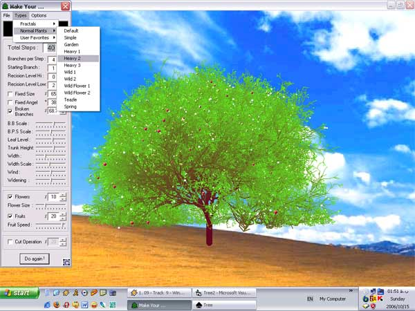



## Real Tree 2 \(Flowers &amp; Fruits\)

### Description

At last, after several years of drought, we are so lucky that our trees bear fruit&#8230;

This is 2nd version of Real Tree, simple and funny. I added some new codes for inserting objects and menus in run time, and show how we can use simple files as our program plugin.

It's recommended that beginners initially see the previous version ( CodeId=66280 ) .

This program contains something about graphics, fractals, API, recursive functions, sounds, menus, sliders, timers and some other VB controls.

----

October.6... added "Save Current Profile".

----

October.10.. added "Save Picture".

----

October.15.. added "Cut Operation".
 
### More Info
 

             |
---                |---
**Submitted On**   |2006-10-08 00:53:06
**By**             |[Mohammad Reza Khosravi](https://github.com/Planet-Source-Code/PSCIndex/blob/master/ByAuthor/mohammad-reza-khosravi.md)
**Level**          |Beginner
**User Rating**    |4.9 (97 globes from 20 users)
**Compatibility**  |VB 6\.0
**Category**       |[Graphics](https://github.com/Planet-Source-Code/PSCIndex/blob/master/ByCategory/graphics__1-46.md)
**World**          |[Visual Basic](https://github.com/Planet-Source-Code/PSCIndex/blob/master/ByWorld/visual-basic.md)
**Archive File**   |[Real\_Tree\_20250610152006\.zip](https://github.com/Planet-Source-Code/mohammad-reza-khosravi-real-tree-2-flowers-amp-fruits__1-66700/archive/master.zip)

